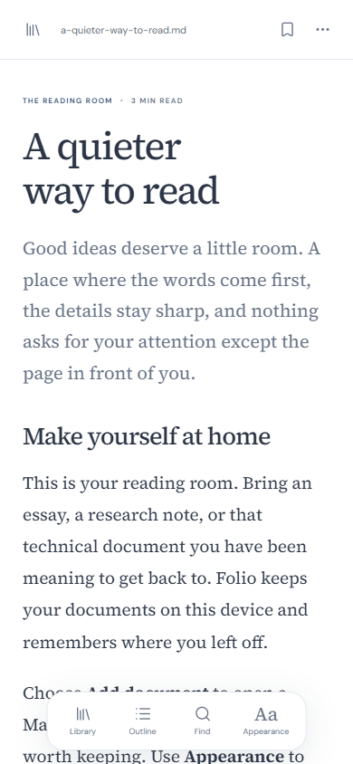

# Folio

A little room to read. Folio is a mobile Markdown reader with Mermaid diagrams, syntax-highlighted code, LaTeX mathematics, and a personal offline library.

**[Open Folio](https://timsamart.github.io/folio/)** · **[Download a release](https://github.com/timsamart/folio/releases/latest)**

## Install on Android

**[Download the Android APK](https://github.com/timsamart/folio/releases/latest)** and install it. Then use **Files → your .md file → Open with → Folio**. Sharing one or more Markdown files to Folio also works. Android may ask you to allow installation from the app used to open the APK.

The APK bundles the reader, fonts, diagrams, code and math for immediate offline use. Accepted files: UTF-8 `.md`, `.markdown`, `.mdown`, and `.txt`, up to 2 MB each. The receiver accepts common Markdown MIME types and generic `application/octet-stream`, then checks the filename and contents. Files are copied into your library; original files remain untouched.

**Moving from the browser app:** export **Document options → Back up library** in the old app, then **Restore library** in the APK. These installations have separate storage. Verify the restore before uninstalling anything.

**Updating the APK:** install the newer APK over the existing app to keep your library. Direct APK installs do not auto-update. Google Play packaging is prepared; the app is not yet published there. See [Android release and store handoff](docs/ANDROID-RELEASE.md).

### Browser installation

The [web reader](https://timsamart.github.io/folio/) remains available. On iPhone/iPad use Safari → Share → Add to Home Screen; on Android and desktop use the browser's Install app command. Keep it open until offline reading is ready. Apply reader updates from the offline/installation panel when offered.

An Android Chrome-installed web app can receive **Share → Folio**, but Android **Open with** requires the APK. If an older PWA is missing from Share, back up its library before reinstalling it from Chrome. On iOS use Folio's own file picker. Browser shares are handled locally by the service worker: up to 20 files, 2 MB each and 20 MB total, with recoverable incoming copies until saved.

## Listen to a passage

Tap **Read aloud**, select an installed device voice, then **Choose a passage**. Play one paragraph from its adjacent button, or use the play button beside a heading in the outline to read that section and its subsections. Paragraph playback stops at the paragraph; section playback stops before the next equal or higher heading.

Pause/resume, previous/next passage, speed, highlight, Locate, and saved listening positions are included. Resume starts at the interrupted sentence; reopening a document never auto-plays. Scrolling manually turns off automatic following. Voice settings apply when you return to playback.

Only voices reported as local and installed are offered. Android has a shortcut to system voice settings for downloading language data. Quality depends on your installed engine and voice. **No Kokoro model, cloud synthesis, voice account, or billing is included.** Playback pauses when the app is backgrounded. Code, diagrams and math receive short markers; image descriptions and footnotes are skipped.

## Read your way

- Open multiple `.md`, `.markdown`, `.mdown`, or `.txt` files, drag and drop, or paste Markdown. Up to 2 MB per document.
- Mermaid diagrams with a larger, scrollable view, readable zoom, and source copying.
- Highlighted code with copying and optional line wrapping.
- KaTeX inline `$...$` and display `$$...$$` mathematics, plus tables, checklists, and footnotes.
- Document and passage search, a navigable outline, bookmarks, and saved reading positions.
- Daylight, paper, night, and system themes; reading fonts, spacing, width, and focus mode.
- Original Markdown download and complete library backup/restore.



## Your documents stay on your device

Folio has no account, analytics, or cloud synchronization. Documents live in the browser or native app's IndexedDB storage. Markdown images load only when requested. Browser storage can be cleared or evicted, so keep an independent backup using **Document options → Back up library**.

Libraries are specific to the device and installation. To move from a local preview or another installation, export a library backup there and restore it here. Normal outbound links and manually loaded images make their usual network requests.

## Run locally

Use Node.js 24 LTS and npm:

```sh
npm ci
npm run dev
```

Open `http://127.0.0.1:5174/folio/`.

```sh
npm run check
npm run build
npm run preview
```

The production preview supports offline caching and installation on localhost. Development mode does not register a service worker.

## Deployment and downloads

Pushes to `main` run the checks, build, and deploy to GitHub Pages through `.github/workflows/pages.yml`. The default base path is `/folio/`. In repository Settings → Pages, the source must be **GitHub Actions**.

The release ZIP contains a ready-to-host static build for a domain root. To produce it locally:

```sh
npm run build:portable
```

Serve the contents of `portable-dist/` at `/` on an HTTPS host. For a local preview, run `python -m http.server 8000 --directory portable-dist` and open `http://localhost:8000`. Opening `index.html` directly as a file is not supported because browser modules and service workers need HTTP(S).

## Implementation and verification

Vanilla JavaScript and Vite; Marked, DOMPurify, Highlight.js, KaTeX, Mermaid, and Lucide. All runtime libraries and fonts are bundled, without a runtime CDN dependency. Raw HTML is shown as text, Markdown output is sanitized, KaTeX uses `trust: false`, and Mermaid uses strict security.

Browser validation covers 320–1440px layouts, offline reloads, all three renderers, malformed diagrams, import and restore, original exports, search, bookmarks, saved positions, reading preferences, and reduced motion. Physical iOS/Android installation remains untested. `npm run build` also verifies that every offline asset exists and that the manifest and hosting paths agree.

Share validation uses real multipart navigation requests through the production service worker, including offline and cold launches, multiple files, generic MIME types, interrupted imports, and invalid input. The Android OS share-sheet registration itself still needs a physical-device check.

With the production preview running, use a fresh Playwright CLI session to repeat the share checks:

```sh
npx --yes --package @playwright/cli playwright-cli -s=share open http://127.0.0.1:5174/folio/
npx --yes --package @playwright/cli playwright-cli -s=share run-code --filename=scripts/check-share-browser.js
```

Design work used Frontend Design, UI/UX Pro Max, and Vercel Web Design Guidelines; browser validation used Playwright.

Bundled fonts use the SIL Open Font License. See [third-party notices](THIRD_PARTY_NOTICES.md) and the license files under `static/licenses/`.


Read [Folio’s privacy explanation](https://timsamart.github.io/folio/privacy.html). The internal `listening/` module separates semantic blocks, playback, voice providers and UI so future providers can be added without rewriting reading behavior.
