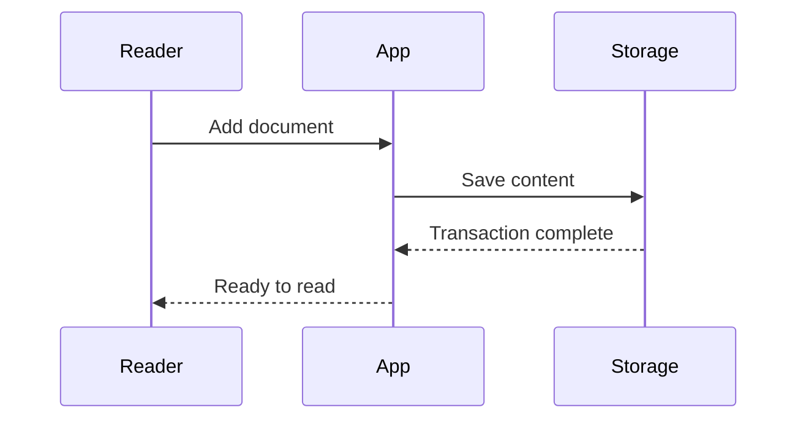

# The art of waiting

Good asynchronous code describes what can happen together and what must happen in order. The difference is easy to miss and worth making explicit.

## Independent work

When tasks do not depend on each other, start them together. Wait for both results before assembling the answer.

```javascript
async function loadReadingRoom() {
  const [library, preferences] = await Promise.all([
    getDocuments(),
    getPreferences(),
  ]);

  return { library, preferences };
}
```

## Dependent work

Some operations have an order. Save the document before reporting that it is safe to close the page.



## Failure is a state

An error should explain what happened and what the reader can do next. It should never quietly turn a failed save into a successful one.

```python
def reading_time(word_count: int, words_per_minute: int = 220):
    """Estimate minutes, with a minimum of one."""
    from math import ceil
    return max(1, ceil(word_count / words_per_minute))
```

## Keep the interface honest

| State | What to show |
| :--- | :--- |
| Loading | A stable place for the content |
| Ready | The thing the reader came for |
| Empty | A clear way to add something |
| Failed | An explanation and a next step |

The goal is not to make waiting disappear. It is to make each state understandable.
