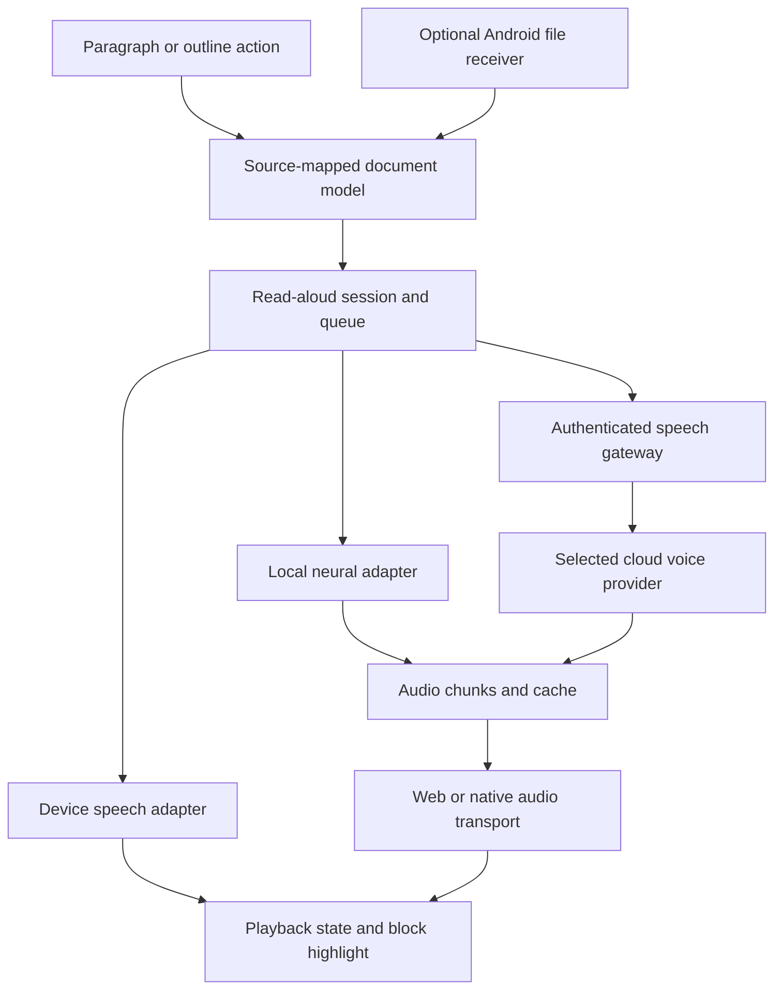

# Folio: modular read-aloud and Android integration

**Project Initiation Document · Draft 0.2 · 13 September 2026**

**Status:** The owner approved implementation after reviewing this PID. Decision recorded 13 September 2026: ship installed on-device voices first, a real public Android APK, and a modular provider boundary. Kokoro, cloud voice providers, billing and user upgrades are deferred. Prepare Google Play packaging; store submission remains a separate owner step. This decision supersedes the evaluation-only recommendation and open-cloud questions in the historical proposal below.

**Implementation scope:** paragraph and outline-section playback; offline voice filtering; pause/resume and separate listening position; foreground playback only; native Open with/Share receivers; signed APK and AAB packaging; public web reader retained. See [Android release notes](ANDROID-RELEASE.md) for the implementation and validation boundary.

## Historical proposal considered before approval

**Product owner:** Folio owner. **Primary audience:** The owner and the eventual implementer. **Baseline:** Folio 1.1.0, commit `6cc3e1ec7bc48bb1885b14ca9ffa5a05181b88f1`.

## 1. Decision in brief

Add a listening experience that feels like part of the reading room: play one paragraph, listen to a section from the outline, or continue from a chosen point. Keep the current typography, quiet interface, and local library. Make speech an optional module with replaceable voice providers.

**Recommendation:** Design one shared reading model and playback controller, retain device voices as a fallback, and evaluate a small set of premium cloud voices before choosing a provider. Keep an on-device neural voice module possible, but do not make a large model download part of the reader's default installation. Treat proper Android file opening as a separate, selectable native delivery track.

The first proposed authorization is a **bounded voice and device evaluation**, not the full feature build. A listening comparison and physical Android tests must precede any promise of excellent voices, dependable screen-off playback, or Google Files integration.

The owner has confirmed the need for paragraph/outline listening, strong voice quality, modular additions, and a PID before implementation. Language priorities and comfort with cloud processing are still open. This draft uses **English and German as an evaluation assumption**, with Greek as an additional candidate; these are not confirmed requirements. Cloud use, budget, and native distribution are also undecided.

## 2. The Android issue, stated accurately

Folio 1.1 registers as an Android **Share** destination. Google Files' **Open with** picker is a different integration. Chrome's web File Handling API is currently limited to desktop systems, so another web-app update cannot make Folio a normal Android `.md` file handler. This is a platform limitation, not evidence that the reader update failed. [Chrome File Handling API](https://developer.chrome.com/docs/capabilities/web-apis/file-handling)

Android distinguishes a viewing intent (`ACTION_VIEW`) from sharing (`ACTION_SEND`). A native Android package can declare a viewing activity and read the content URI granted to it. The proposal is to reuse Folio's web interface inside an Android shell, with a narrow file-receiving bridge; this still requires real Android implementation and testing. [Android intents](https://developer.android.com/guide/components/intents-filters), [document access](https://developer.android.com/training/data-storage/shared/documents-files)

The PID therefore separates two outcomes:

| Outcome | Web app | Optional Android package |
|---|---|---|
| Import a file inside Folio | Already available | Retain it |
| Share a file to Folio | Implemented; physical registration remains unverified | Handle native sharing too |
| Google Files → Open with → Folio | Not promised | Explicit acceptance requirement |
| Open files as the default reader | Not promised on Android | OS and file-manager dependent; test supported MIME types |
| Long listening with screen locked | Must be evaluated; no blanket guarantee | Native media service is the proposed route |

A wrapper alone does not automatically deliver native file handling or background audio. A Trusted Web Activity also should not be assumed to solve these without additional native integration.

## 3. Product goals and boundaries

The benefit is continuity: a reader can rest their eyes, listen while moving, replay a difficult paragraph, and return to the exact place in the document.

The first usable release should include paragraph playback, bounded section playback, continue-from-here, play/pause/stop, previous/next paragraph, speed and voice choices, highlighting of the active block, and a saved listening position. Voice samples should be short, comparable, and available before committing a document to an engine.

Preserve normal text selection, links, outline navigation, code copying, math and diagram rendering, existing backups, and silent reading. No speech starts on document open. No cloud call occurs simply because the speech feature is installed or a document is imported.

Outside the initial scope: voice cloning, conversational assistants, automatic summaries, translation, generated diagram explanations, a public plugin marketplace, library cloud sync, and full audiobook export. These can be later modules if separately chosen. A complete iOS native app is also outside this Android-led proposal.

## 4. Listening experience

| Entry point | Proposed interaction | Exact playback boundary |
|---|---|---|
| A paragraph | Choose **Listen** once, then use the visible play control beside a paragraph | That paragraph only; stop at its end |
| An outline entry | A separate, labelled play button alongside the existing navigation link | The heading and its section, including subsections, until the next heading of equal or higher rank |
| Continue from here | Secondary action on a paragraph or heading | Continue to the document's end |
| Selected text | Optional enhancement through an in-app **Read selection** action | Only the selected range inside the document |

Paragraph controls appear in listening mode, with at least 44 × 44 CSS-pixel targets. Do not make every ordinary tap start speech, require hover, or replace the operating system's long-press selection menu. The selection enhancement can ship later if it conflicts with mobile selection handles; paragraph and outline playback must work independently of it.

Keep ordinary taps on an outline title as navigation. Its adjacent play button has an accessible name such as “Listen to section: Deployment.” A heading-only section reads its title once and stops. A scope with no eligible text explains this rather than jumping silently into the next section. Repeated titles and skipped heading levels must be handled correctly.

A compact player sits above the existing mobile navigation and respects the safe area. It shows the section title, play/pause, previous/next block, speed, and an expandable voice/settings panel. Expanded controls expose Stop and **Follow text**. Manual scrolling suspends following; **Return to spoken text** restores it. Pause/stop never remove the reader's visual position.

Show a subtle active-paragraph highlight. Word highlighting is an enhancement only when genuine timing data exists. Do not simulate accurate word timing from character counts. Browser speech boundary events have uneven support, and provider timing has to be mapped to the normalized text. [Browser boundary events](https://developer.mozilla.org/en-US/docs/Web/API/SpeechSynthesisUtterance/boundary_event), [ElevenLabs speech timing](https://elevenlabs.io/docs/api-reference/text-to-speech/stream-with-timestamps)

Opening a different document stops the old listening session. Choosing another paragraph cancels the previous queue before starting the new one. Changing the voice restarts the current block after confirmation through the playback action; it must not synthesize the rest of the library. Resume after reopening is offered, never automatic.

**Scope contract:** Previous/next moves only among the logical blocks in the chosen scope and is disabled at its edges. Paragraph-only mode therefore has no next-paragraph action; choose another paragraph or **Continue from here** to start a new scope. Replay restarts the current logical block. Internal chunks of a long paragraph do not become separate navigation items. Each prose paragraph inside a quotation is a block; a list item's own text is a block, with child paragraphs/items traversed separately without repeating parent text. A heading is a structural block when listening to a section. Navigation and prefetch must never expand the selected scope implicitly.

## 5. What Markdown should sound like

Build a speech representation from structured Markdown, not the complete rendered page's `innerText`. The latter can duplicate KaTeX content, include buttons, and misread diagram labels. Speech should faithfully read the document, without silently paraphrasing it.

| Content | Initial speaking policy |
|---|---|
| Prose, headings, quotations, lists | Read in document order with natural pauses; avoid reading formatting punctuation |
| Links | Read their label; do not spell long URLs unless explicitly requested |
| Footnotes | Skip inline by default; allow a separate footnote action; never read return arrows |
| Inline code | Read the identifier as text, subject to a pronunciation preference |
| Fenced code | Announce the language and skip the body by default; offer literal code reading as a separate action |
| Display mathematics | Announce “Equation”; keep the formula available visually. A math-to-speech adapter is a later evaluation, not an LLM guess |
| Inline mathematics | Say “inline equation” once per expression, preserving the surrounding prose. This marks omitted mathematical content; it does not claim to convey the expression's meaning |
| Mermaid | Announce “Diagram” and an authored accessible title if present; do not infer relationships or read generated SVG/UI labels as prose |
| Tables | Announce a table; explicit row-by-row reading pairs cell content with column headers and indicates missing headers |
| Images | Use authored alternative text when requested; do not fetch an image to speak about it |
| Frontmatter and controls | Exclude metadata, Copy/Wrap buttons, navigation, and status messages |

An optional “include technical blocks” preference must name what it does. Spoken code, advanced mathematics, and table navigation need independent evaluation because a pleasant prose voice does not establish technical accuracy.

For every evaluation passage, author an expected spoken transcript that records literal text, announcements, and intentional exclusions. Test fidelity to that transcript separately from whether the narration conveys the complete technical meaning. The initial release explicitly does not provide full mathematical narration; show this limitation in listening settings.

## 6. Voice options and recommendation

This is a capability comparison, **not a completed listening benchmark**. No samples have been synthesized or scored for this PID. Provider claims about naturalness are not treated as measured Folio quality.

| Option | Verified basis and likely role | Main limitation for Folio |
|---|---|---|
| Device/browser speech | Enumerates the voices available on the device. No Folio cloud gateway is needed. Suitable as a low-setup fallback | Voice availability, quality, timing, and pause behavior vary. Some system voices are remote, not offline |
| Kokoro in the browser | Open-weight 82M model with Apache-licensed weights; the project's JS implementation supports local WASM/WebGPU inference | Optional download, memory, battery, and sustained phone speed require measurement. Published languages omit German and Greek |
| ElevenLabs Multilingual v2 / v3 | v2 is positioned for consistent long-form narration; v3 provides more expressive delivery. English, German, and Greek are supported | Cloud processing, recurring costs, and provider-specific limits. Expressiveness may be distracting for technical prose |
| OpenAI `gpt-4o-mini-tts` | Streamed audio and instruction-based delivery controls; official guidance recommends auditioning `marin` or `cedar` | Voices are optimized for English; German/Greek quality needs a listening test. Do not assume word timestamps |
| Google Chirp 3 HD | Published English, German, and Greek support, plus streaming and batch audio | Cloud processing; SSML support is limited and currently differs between synchronous and streaming requests |
| Azure Speech | Broad neural/HD voice catalog, with English, German, and Greek listed | Voice, feature, region, and price must be resolved together. Keep as an alternate if the first comparison has a language or pronunciation gap |

Sources: [device voice locality](https://developer.mozilla.org/en-US/docs/Web/API/SpeechSynthesisVoice/localService), [Kokoro model](https://huggingface.co/hexgrad/Kokoro-82M), [Kokoro languages](https://github.com/hexgrad/kokoro#advanced-usage), [Kokoro JS](https://github.com/hexgrad/kokoro/blob/main/kokoro.js/README.md), [ElevenLabs models](https://elevenlabs.io/docs/overview/models), [OpenAI speech guide](https://developers.openai.com/api/docs/guides/text-to-speech), [Chirp 3 HD](https://docs.cloud.google.com/text-to-speech/docs/chirp3-hd), [Azure voice support](https://learn.microsoft.com/en-us/azure/ai-services/speech-service/language-support?tabs=tts).

**Proposed shortlist:** Listen to ElevenLabs Multilingual v2, Google Chirp 3 HD, and OpenAI Mini TTS on the same material. Include the phone's best available system voice as the baseline. Try Eleven v3 only if its delivery improves the owner's preference, and Kokoro only for languages it supports. Keep at most three curated voice choices per language in the initial product, plus an optional advanced picker.

If cloud processing is unacceptable, remove cloud engines from the implementation scope. Evaluate installed device voices first, then suitable local models for the confirmed languages. Kokoro alone cannot satisfy a German/Greek requirement. If no local candidate meets the listening target on the phone, report the unmet requirement rather than relabelling a weak voice as “premium.”

**Offline means two distinct things:** a local voice can synthesize new text without a connection; downloaded cloud-generated audio can be replayed offline, but cannot generate unread material offline. The UI must distinguish these.

## 7. Modular design

The inspected application uses `app.js` for interaction and reading state, `renderer.js` for Marked/KaTeX/Mermaid rendering and heading discovery, and `storage.js` for the local library. There is no current speech module or feature registry. Rendering currently produces DOM headings rather than a reusable source-mapped reading model.

Introduce explicit internal extension points rather than a general-purpose plugin system:

| Module | Responsibility and boundary |
|---|---|
| `document-model` | Produce ordered blocks, heading hierarchy, source ranges, and document revision identity from the same Markdown interpretation used for display |
| `feature-registry` | Register trusted, bundled optional features and their commands; lazy-load them on use; dispose listeners and controls when disabled |
| `read-aloud` | Convert a selected scope into a speech plan; own queue, state, resume position, and cancellation |
| Voice adapters | Discover voices and state capabilities: languages, local/remote execution, audio generation, timing, pause/resume, and output formats |
| Audio transport | Play generated chunks, buffer conservatively, control speed, and expose supported media controls |
| Audio cache | Store completed audio chunks and timing separately from documents; manage size, retention, and removal |
| Optional speech gateway | Authenticate cloud requests, keep provider credentials on the server, enforce spending limits, and stream audio |
| Optional Android bridge | Receive native file intents and connect to native playback services; reuse the document and player contracts |

The diagram is a proposed dependency map, not existing code. All new speech-specific dependencies should load after an explicit listening action. The existing offline precache must not automatically download neural model weights or synthesized audio.

**A useful abstraction must preserve real differences.** Browser speech generally plays utterances directly; it does not hand Folio an exportable audio buffer. Cloud and local neural engines produce audio that Folio can cache and play. Use a common session interface with capability flags and separate direct-speech and generated-audio adapters. Do not invent an audio export or exact seek implementation for a provider that lacks it.

A speech plan identifies the document, content revision, ordered block IDs, heading scope, normalized speech, language, and pronunciation-policy version. IDs must survive theme changes and renderer completion; document edits create a new revision. Maintain mappings between source ranges, spoken text, and rendered blocks. Test frontmatter, CRLF, repeated text, nested lists, duplicate headings, and synthetic document titles before relying on offsets.

Default chunks follow paragraph boundaries; split exceptionally long paragraphs at sentence boundaries within provider limits. Preserve a parent block reference for highlighting. Prefetch at most two chunks within the explicitly requested scope. A new session invalidates old results; late network responses must never restart stopped audio. Aborted provider work may still be billable.

Save visual reading position and listening position separately. Resume at a block boundary where finer timing is unavailable. Cache identity includes content revision, normalized text, language, provider/model version, voice, synthesis settings, and normalization version. Playback-only speed changes should reuse audio; synthesis-setting changes may require regeneration.

## 8. Privacy, costs, and hosting

Folio's current local-library promise is valuable. Cloud narration must be an explicit choice with the provider named and the selected scope explained before the first request. The initial preference should be **Ask before using a cloud voice**. Consent to a section includes its limited prefetch; it does not authorize sending other documents. Never silently fall back from a local engine to a remote one.

Apply the same rule to system voices: classify `localService=false` as remote and unknown execution as unverified. Both require disclosure and consent, and both are unavailable under device-only policy. When the browser does not identify the remote service, say so; do not invent its operator or route it through Folio's gateway. A voice reporting local execution still needs an airplane-mode test before it receives an “offline verified” label.

GitHub Pages remains suitable for the reader, but a public static bundle cannot protect a provider API key. If cloud speech is chosen, add a small authenticated gateway on a separately selected host. CORS is not authentication. The initial gateway should be restricted to the owner/test users, with request-size limits, quotas, and a hard spending ceiling; public access is a separate decision.

Keep document text, audio, file names, and credentials out of routine gateway logs. Document the selected provider's actual retention and region configuration before launch; this PID does not claim zero retention from an unconfigured vendor. Show a synthetic-voice disclosure. Voice cloning is not in scope.

Audio stays separate from the core library backup by default. Propose a visible 100 MB automatic audio-cache limit with least-recently-used eviction; pinned downloads require an explicit space check. Show download size, missing chunks, and deletion controls. Removing a document removes its cached narration. Removing the speech module removes voice downloads and audio only after a clear storage choice, while keeping Markdown intact.

### Illustrative operating costs

Public list rates checked on 13 September 2026; USD, before taxes, hosting, storage, free allowances, subscriptions, or negotiated discounts. These are planning estimates, not a purchase or a guaranteed bill.

For the character-priced examples, assume 1,000 characters per minute: **10 hours of newly generated narration ≈ 600,000 characters**. Actual language, delivery speed, and punctuation change this conversion.

| Engine | Published billing basis | Example for 600,000 new characters |
|---|---|---|
| ElevenLabs Multilingual v2 / v3 | $0.10 per 1,000 characters | $60 |
| ElevenLabs Flash / Turbo | $0.05 per 1,000 characters | $30 |
| Google Chirp 3 HD | $30 per million characters after free allowance | $18 before applying allowance |
| OpenAI Mini TTS | $0.60 per million input text tokens; $12 per million output audio tokens | Measure token usage in the evaluation; do not equate characters with tokens |
| Local device / downloaded local model | No Folio per-character synthesis charge | Device storage, energy, initial distribution, and maintenance still have costs |

Sources: [ElevenLabs API rates](https://elevenlabs.io/pricing/api), [Google TTS pricing](https://cloud.google.com/text-to-speech/pricing), [OpenAI model pricing](https://developers.openai.com/api/docs/models/gpt-4o-mini-tts).

Replay of a cached chunk should make no new synthesis call. A future batch-download action should estimate scope and cost before starting. Set the trial budget and monthly owner budget before enabling a paid provider; no monetary limit is presumed approved here.

## 9. Native Android delivery option

**Preferred route to evaluate:** A small Capacitor-based Android shell, bundling the Folio web interface and adding only the required native services. Capacitor provides an Android container, but the file and media bridges remain project work. A Kotlin shell is an alternative if the bridge requirements make it simpler. [Capacitor Android](https://capacitorjs.com/docs/android)

The file receiver should accept granted `content://` URIs, check display name, MIME type, size, and actual content, and copy the selected Markdown into Folio's library while the grant is valid. Android providers can report `.md` as `text/markdown`, `text/plain`, or generic binary data; matching by file extension alone is insufficient. Broad MIME matching makes the app appear for unrelated files, so validate before import and test the narrowest practical filters. Request access only to the selected files, not all device storage.

For dependable background playback, evaluate a native Media3 session/service with audio focus, headset controls, interruption handling, and a notification. Android documents this as a way to keep playback independent of the activity. A WebView alone does not prove that browser speech or in-browser neural generation will continue when suspended. [Android background playback](https://developer.android.com/media/media3/session/background-playback)

Make two separate native decisions before implementation: **N1, file opening**, and **N2, background listening**. N1 can ship without N2. For N2, choose prepared-section playback or continued generation while the app is suspended; those have different engineering costs and queue owners. Prepared-section mode must finish its download before promising offline listening. Continuous mode needs a native-owned generation and playback queue, with access to the approved provider/authentication path; a JavaScript queue must not be assumed to survive suspension. Test beyond the prebuffered duration with screen lock and network interruption. Do not promise uninterrupted whole-document playback until generation, queueing, and transport have all passed that test.

The package has a separate storage context from Chrome. Provide an explicit PWA backup → native restore path; do not claim automatic library migration. Also choose app identity, signing-key ownership, APK versus Play Store distribution, and an update mechanism before release. Keep a visible version, update state, and separate explanations for reader updates and Android-package updates.

## 10. Quality gates

All numeric targets below are proposed acceptance targets, not measurements achieved by this PID.

| Area | Acceptance test |
|---|---|
| Scope correctness | A paragraph stops exactly at its end; a section includes descendants and stops before the next equal/higher heading; previous/next stays in scope; list/quote text is not duplicated; heading-only scopes stop after the title; continue-from-here reaches the document end |
| Voice quality | Owner blind-rates samples at least 4/5 for naturalness, pronunciation, and comfortable long listening in every required language; no unintended omissions or invented words relative to the authored expected spoken transcript |
| Start and stop | Warm local/cached playback starts within 0.5 s; cloud first audio targets p95 ≤3 s on the specified Wi-Fi/device; Stop silences playback within 250 ms |
| Position and queue | No duplicate/overlapping audio after rapid taps, voice changes, document switching, reload, or reconnection; resume returns to the correct block |
| Technical content | No duplicate KaTeX reading, SVG label dumps, UI labels, or silently omitted technical blocks; policies match the visible settings |
| Accessibility | All controls work with TalkBack and keyboard; visible focus, clear names, large targets, reduced motion, and manual scrolling remain intact |
| Offline and privacy | Airplane-mode tests distinguish local synthesis from cached playback; remote/unverified system voices obey consent and device-only policy; no text requests occur before consent; only the selected scope is transmitted |
| Background listening | A 30-minute section on the owner's Android phone, screen locked, headset pause/resume, incoming audio interruption, and network loss. For continuous generation, exceed the prebuffered duration. Test PWA and native behavior separately |
| Android file handling | Google Files → Open with → Folio tested with `.md`, uppercase `.MD`, alternate MIME types, offline launch, inaccessible URI, empty file, and oversized file |
| Regression | Existing imports, Share → Folio, Mermaid, code, math, themes, saved positions, backups, and offline reading still pass |
| Performance and recovery | Listening disabled adds no model download; failed synthesis preserves the reading position; quota exhaustion pauses cleanly without falling into a paid engine |
| Cloud release controls | No credentials in shipped assets, browser storage, or logs; unauthorized requests rejected; concurrent requests reserve budget atomically; cache deletion removes associated audio; actual provider retention/region configuration documented and accepted |

Voice comparison corpus: two short prose passages, one 5-minute passage, and a technical passage containing names, abbreviations, numbers, dates, code, and formulas per required language. Add one mixed-language passage if required. Use authored/non-private text, normalize loudness, compare at the same listening speed, and blind-label providers. Record device/browser versions, voice/model IDs, first-audio latency, generation throughput, actual billed usage, and the owner's preferences. Provider marketing latency excludes parts of Folio's pipeline and is not an app-level target.

Web media controls can be exposed through Media Session where supported; this does not itself guarantee that an OS will keep every synthesis engine alive in the background. [Media Session API](https://developer.mozilla.org/en-US/docs/Web/API/Media_Session_API)

For the cloud track, test stopping and quota exhaustion while requests are in flight. Stop must silence audio and prevent further submissions. Reserve a conservative maximum charge before each provider request and reconcile actual usage afterwards; already submitted work may incur charges and must not be counted as free simply because playback was cancelled. The proposed spending ceiling controls accepted work, with the provider's billing mechanics verified in Gate A.

## 11. Proposed delivery and decisions

| Gate | Deliverable | Preliminary effort* | Exit decision |
|---|---|---|---|
| A. Voice and device evaluation | Comparable voice samples, owner ratings, phone playback/file-intent findings, measured cost | 2–4 engineering days | Pick required languages, voice engine, cloud policy, and whether native delivery is necessary |
| B. Shared document model | Source-mapped blocks, section boundaries, trusted feature registration | 3–5 days | Accept exact selection semantics and rendering regression results |
| C. Read-aloud release candidate | Paragraph/outline player, one selected premium adapter if approved, device fallback, gateway if needed, bounded cache and resume | 6–10 days | Accept UX, voice quality, privacy, costs, and physical-device findings |
| D. Optional Android package | Native file receiver, migration, media service as required, signing and distribution | 5–10 days | Accept actual Google Files integration and the promised background behavior |
| E. Hardening and release | Accessibility, failure cases, upgrades, documentation, controlled rollout | 2–4 days | Owner approves release |

*Rough planning ranges for one experienced implementer, not a quotation or calendar commitment. PWA track A+B+C+E totals 13–23 engineering days; adding D totals 18–33. Model optimization, new offline languages, account billing, store review, or advanced math speech can exceed these ranges. No stage starts merely because the PID exists.*

**Gate A authorization packet:** Before starting, record the required languages, phone model and Android/browser versions, permitted local/remote engines, non-private evaluation text, and a maximum monetary spend. Approval of that packet permits disposable evaluation scripts, temporary restricted provider credentials and sample generation only for the selected engines, within that cap. If native behavior is included, explicitly include a disposable Android intent/media prototype and its installation on the chosen test phone. If that is excluded, Gate A returns native behavior as untested rather than implying a pass. It does not authorize production integration, changes to the published reader, public cloud access, subscriptions, app-store submission, or production signing. Resolve N1/N2 and the N2 playback mode before the affected work in C or D.

Major risks are mobile background suspension, a mismatch between preferred voice and required language, cloud privacy/cost changes, imprecise Markdown-to-speech mapping, and confusing update paths. The gates above turn these into tests before broad promises or rollout.

The owner needs to decide:

1. **Languages:** English, German, Greek, and any others; whether mixed-language paragraphs matter.
2. **Voice policy:** Device-only, optional cloud after consent, or quality-first cloud with a local fallback.
3. **Android scope:** Share remains sufficient, or proper Google Files Open with and screen-off listening are required for the first release.
4. **Budget and audience:** Personal evaluation and monthly ceilings; owner-only premium access or a later public service.
5. **Next authorization:** Revise this PID, or approve Gate A only. Provider integration, native packaging, and deployment are subsequent decisions.

The recommended decision is **Gate A only**, followed by a short review of actual voices and phone behavior. This protects the existing app while giving the larger design an evidence-based foundation.

## 12. Evidence and current limits

The current Folio source, manifest, storage, rendering, and README were inspected. Provider and browser capabilities above come from the linked primary documentation, checked on the date of this draft. All architecture, UX, budget controls, acceptance targets, and effort ranges are proposals.

No voices were auditioned, no new dependencies installed, no Android package built, no paid speech requested, and no implementation or deployment performed for this PID. Existing Chromium checks for the share receiver do not establish that the Google Files Open with flow works. Physical Android behavior and subjective voice quality remain evaluation work.
