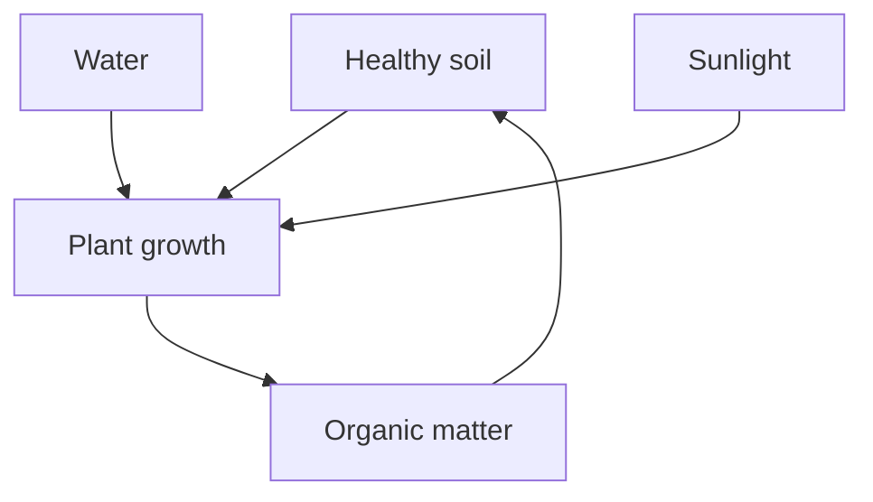

# Thinking in systems

A system is more than a collection of parts. It is a pattern of relationships, carrying information and responding to change.

## Start with the connections

Consider a small garden. Sunlight, soil, water, and living things are connected. Changing one element affects the rest, often with a delay.

## Notice the feedback

**Reinforcing loops** amplify change. **Balancing loops** tend to keep a system near a target. A useful question is: what happens next, and what comes back?

> Look for the relationship before you look for the solution.

## Remember the delay

Not every response is immediate. A simple first-order response approaches a target gradually:

$$
x(t) = x_{\infty} + (x_0 - x_{\infty})e^{-t/\tau}
$$

Here $\tau$ is the time constant. After one time constant, the system has moved about 63% of the way from its initial value to its target.

## A field checklist

- [ ] Draw the boundary of the system.
- [ ] Identify the important stocks and flows.
- [ ] Trace at least one feedback loop.
- [ ] Look for delays and unintended effects.
- [ ] Revisit the model when new evidence arrives.
