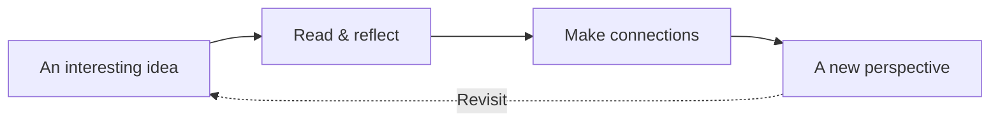

# A quieter way to read

Good ideas deserve a little room. A place where the words come first, the details stay sharp, and nothing asks for your attention except the page in front of you.

## Make yourself at home

This is your reading room. Bring an essay, a research note, or that technical document you have been meaning to get back to. Folio keeps your documents on this device and remembers where you left off.

Choose **Add document** to open a Markdown file or paste something worth keeping. Use **Appearance** to find your reading rhythm: a different typeface, a little more space, or a darker page for the evening.

> The secret of a good reading experience is simple: keep the complexity in the document, and the calm in the interface.

## See the whole idea

Some thoughts are easier to follow as a picture. Mermaid diagrams are rendered right here, in the flow of your reading. Expand a diagram when the details need more room.



A diagram should help you understand the text, not send you somewhere else. The **Expand** control gives it a larger canvas, with zoom and a copy of its source close at hand.

## Read between the lines

Code is part of the story, too. Language-aware highlighting keeps its structure clear. Copy a complete example with one tap, or turn on wrapping when a line runs beyond the page.

```typescript
type ReadingSession = {
  document: string;
  interruptions: number;
  curiosity: 'always';
};

function beginReading(document: string): ReadingSession {
  return { document, interruptions: 0, curiosity: 'always' };
}

const afternoon = beginReading('something-worth-reading.md');
```

Inline code such as `beginReading()` sits comfortably inside a sentence. Fenced blocks keep their indentation, line breaks, and original source intact.

## Give every detail its due

Mathematics belongs on the page. Inline expressions like $e^{i\pi} + 1 = 0$ fit naturally into a paragraph, while larger equations get space of their own.

$$
\int_{-\infty}^{\infty} e^{-x^2}\,dx = \sqrt{\pi}
$$

Tables, checklists, and footnotes are small details that make long documents easier to navigate.[^1]

| When you want to… | Reach for… |
| :--- | :--- |
| Pick up where you stopped | Your saved reading position |
| Jump to a section | The document outline |
| Find a particular phrase | Search in this document |
| Keep something close | A bookmark |
| Read without a connection | Offline reading |

- [x] A clear place to start
- [x] Room for words, code, and ideas
- [ ] Something new to discover

## Leave a little room

There is no finish line here. Read a paragraph. Follow a footnote. Put a bookmark in something you want to revisit.

Your files stay yours. You can download the original Markdown at any time from the document menu. Once the offline indicator is ready, your library and all three renderers are available without a connection.

*Settle in. The rest can wait.*

[^1]: Footnote links work in both directions. Follow the reference, then use the return arrow to find your place again.
